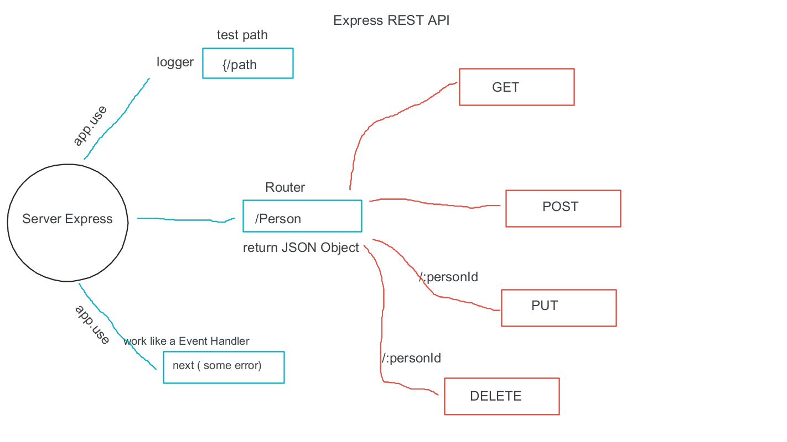
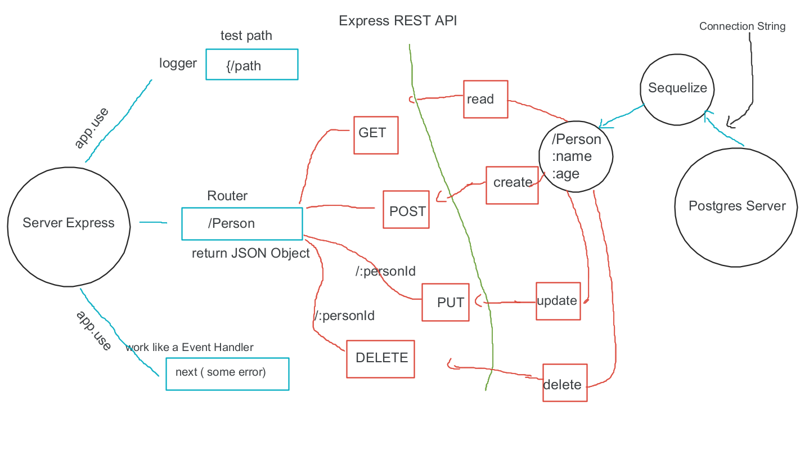
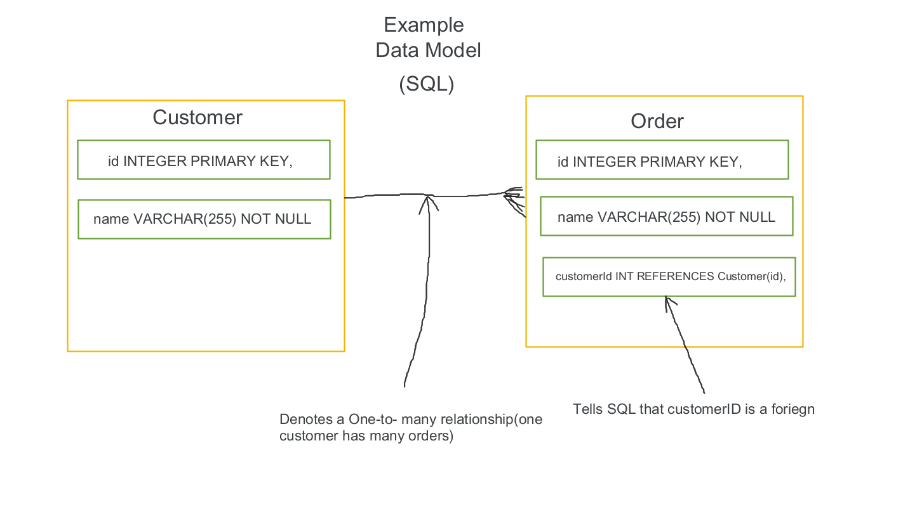

# api-server

## Express REST API

  - Build a REST API server using Express.

  - Use Sequelize models and schemas to perform CRUD operations.

  - Respond to request Queries and Parameters in routes.

  - Testing code that relies on a Postgres Database server.

## Data Modeling

  - Swaped out the route handler functions in favor of a Collection Interface 

  - Perform generic Database CRUD operations

  - Created a Collection Class that accepts a Sequelize Model into the constructor and

## UML diagrams

  - Express RESTful CRUD Model
    

  - Express RESTful CRUD Model
    

  - Data Model
    

## Routes

### - /car

  #### - GET
  - Status Code (200)
  - JSON Data response:
    - (car) data:
      - name: STRING
      - color: STRING
      - doors: INTEGER

  #### - GET
  - /car/:carId
    - Status Code (200)
    - JSON Data response:
      - one (car) data on (carId):
        - name : STRING
        - color: STRING
        - doors: INTEGER
        
  #### - POST
  - Status Code (200)
  - JSON Data response:
    - Creates new (car) data:
      - name : STRING
      - color: STRING
      - doors: INTEGER

  #### - PUT
  - Status Code (200)
  - JSON Data response:
    - Update one (car) data on (carId):
      - name : STRING
      - color: STRING
      - doors: INTEGER

  #### - DELETE 
  - Status Code (200)
  - Delete one (car) data on (carId)

### - /game

  #### - GET
  - Status Code (200)
  - JSON Data response:
    - (game) data:
      - name : STRING
      - type: STRING
      - players: INTEGER

  #### - GET
  - /game/:gameId
    - Status Code (200)
    - JSON Data response:
      - one (game) data on (gameId):
        - name : STRING
        - type: STRING
        - players: INTEGER
        
  #### - POST
  - Status Code (200)
  - JSON Data response:
    - Creates new (game) data:
      - name : STRING
      - type: STRING
      - players: INTEGER

  #### - PUT
  - Status Code (200)
  - JSON Data response:
    - Update one (game) data on (gameId):
      - name : STRING
      - type: STRING
      - players: INTEGER

  #### - DELETE 
  - Status Code (204)
  - Delete one (game) data on (gameId)

## Links

  - [Heroku Deploy site](https://louis-api-server.herokuapp.com/)
